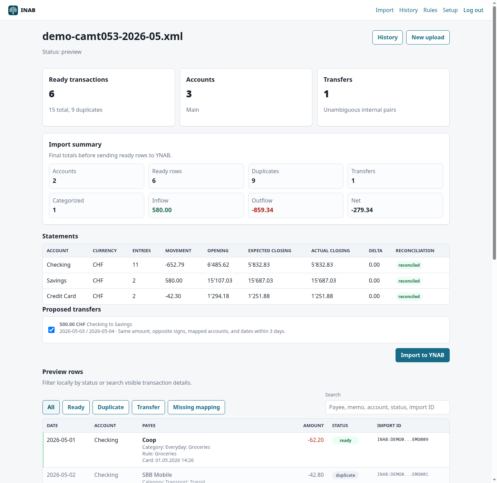
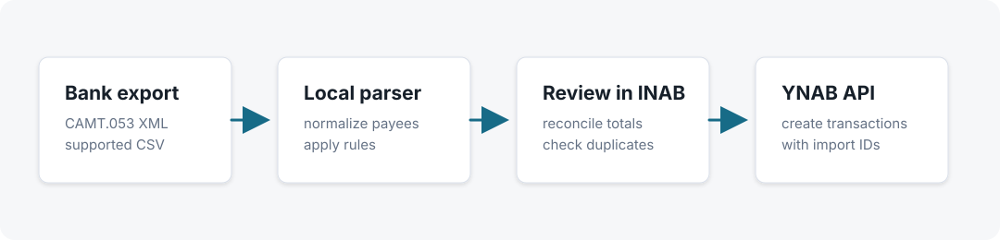

# INAB

Import Swiss bank statements into YNAB or Actual Budget from a self-hosted web app.

INAB parses CAMT.053 XML and supported CSV exports locally, lets you review them, then creates the confirmed transactions in the configured budget backend.



## How It Works



1. Export a CAMT.053 XML file or supported CSV file from your bank.
2. Upload it to INAB. Parsing, rules, duplicate checks, and transfer detection run locally.
3. Review the preview screen.
4. Import approved rows to the configured budget backend.

## What It Does

- Imports Swiss CAMT.053 account statements and supported semicolon CSV exports.
- Handles multi-account CAMT files with one or more `<Stmt>` blocks.
- Stores IBAN-to-budget-account mappings in local SQLite.
- Previews rows before import, including reconciliation totals and duplicate matches.
- Detects likely internal transfers between mapped accounts.
- Uses deterministic INAB import IDs to avoid repeat imports.
- Keeps import history and can undo transactions created by INAB.

## Supported Banks And Formats

| Format       | Support                                                                   |
| ------------ | ------------------------------------------------------------------------- |
| CAMT.053 XML | Tested Swiss CAMT.053 exports are supported.                              |
| CSV          | Neon CSV exports are supported. Other bank CSV layouts are not supported yet. |
| MT940        | Not supported                                                             |

## Quick Start

```sh
uv sync --extra dev

export YNAB_ACCESS_TOKEN="..."
export INAB_BACKEND="ynab"
export INAB_USERNAME="inab"
export INAB_PASSWORD="choose-a-password"

uv run uvicorn inab.web:create_app --factory --reload
```

Open <http://127.0.0.1:8000> and sign in. Choose your budget in Setup, then upload a CAMT.053 XML file once so INAB can discover IBANs. Map each discovered IBAN to a budget account, upload again, review the preview, and import.

For CSV uploads, choose the target budget account on the upload form. The supported CSV format does not include an account identifier.

## Privacy And Data

INAB runs on your machine or server. Bank exports are parsed on the machine running the app, and local state is stored in SQLite under `INAB_DATA_DIR`.

Stored locally:

- account mappings
- import rules
- import history
- observed IBANs and counterparty labels
- transaction IDs created by INAB, used for undo

Sent to the configured backend:

- transactions you confirm for import
- account, budget, payee, and category lookups needed by the UI

Not stored in SQLite:

- `YNAB_ACCESS_TOKEN`, which stays in your deployment environment
- `ACTUAL_PASSWORD` and `ACTUAL_ENCRYPTION_PASSWORD`, which stay in your deployment environment
- the uploaded bank file itself

Backend-specific local state is stored separately by default: `INAB_DATA_DIR/ynab/inab.sqlite3` or `INAB_DATA_DIR/actual/inab.sqlite3`. `ACTUAL_DATA_DIR` is only actualpy's local cache for the downloaded Actual budget, not INAB's rules or mappings database.

## Docker

```sh
docker build -t inab .
docker run --rm -p 8000:8000 \
  -e INAB_BACKEND="ynab" \
  -e YNAB_ACCESS_TOKEN="$YNAB_ACCESS_TOKEN" \
  -e INAB_USERNAME="inab" \
  -e INAB_PASSWORD="choose-a-password" \
  -v "$PWD/data:/data" \
  inab
```

If you expose INAB outside localhost, put it behind HTTPS. Keep `/data` on persistent storage.

## Configuration

Backend selection:

```sh
INAB_BACKEND="ynab"  # or "actual"
```

Required for YNAB:

```sh
YNAB_ACCESS_TOKEN="..."
```

Required for Actual Budget:

```sh
ACTUAL_BASE_URL="https://actual.example"
ACTUAL_PASSWORD="..."
ACTUAL_BUDGET="Household"
```

Actual optional settings:

```sh
ACTUAL_ENCRYPTION_PASSWORD=""
ACTUAL_DATA_DIR="./data/actual-cache"
ACTUAL_VERIFY_SSL="true"  # true, false, or a certificate path
```

Shared required:

```sh
INAB_USERNAME="inab"
INAB_PASSWORD="choose-a-password"
```

Optional:

```sh
INAB_DATA_DIR="./data"
INAB_DATABASE_PATH="./data/custom-inab.sqlite3"
INAB_SESSION_SECRET="stable-cookie-signing-secret"
INAB_MAX_UPLOAD_BYTES="10485760"
INAB_TARGET_CURRENCY="CHF"
INAB_SELF_NAMES="Alex Example,Example Alex"
INAB_ROOT_PATH="/inab"
```

Set `INAB_ROOT_PATH` only when publishing the app under a URL prefix such as `https://example.test/inab`.

## Import Rules

INAB can rewrite payees and assign backend categories before import. Rules are edited in the web UI and stored in SQLite. The preview shows the original payee, matched rule, and assigned category before import.

## Actual Budget Analysis

See [docs/actual-budget-analysis.md](docs/actual-budget-analysis.md) for the design reference for Actual Budget support through `actualpy`.

## Import Behavior

- CAMT `DBIT` entries become negative amounts; `CRDT` entries become positive amounts.
- CSV `Amount` values are already signed.
- YNAB amounts are converted to milliunits with `Decimal * 1000`; Actual Budget receives decimal amounts through actualpy.
- Imported transactions are marked cleared where the backend supports it.
- `AcctSvcrRef` becomes `INAB:<AcctSvcrRef>` when it fits YNAB's 36-character import ID limit.
- Rows without a usable bank reference get a deterministic hash-based `INAB:<hash>` import ID.
- Before import, INAB fetches existing backend transactions for each mapped account and skips matching import IDs.
- YNAB can match an INAB-imported row to a user-entered transaction on the same account with the same amount and a date within 10 days.
- Actual Budget duplicate preview compares Actual `financial_id` / imported IDs against INAB import IDs.
- YNAB transfer pairs are imported once from the debit-side account using the target account's `transfer_payee_id`.
- Actual Budget transfer pairs are created with actualpy `create_transfer`; INAB sets import IDs on both generated sides for future duplicate detection.
- Preview, blocked, and failed jobs without created transaction IDs are pruned after 7 days.

Known Actual Budget limitations:

- Undo uses actualpy's transaction delete helper when present, otherwise marks the transaction tombstoned, then commits. This is covered by unit tests but should still be verified against a disposable hosted Actual budget before production use.
- actualpy sync commits are not atomic if interrupted.

## YNAB API

INAB uses the official `ynab` package, pinned to `4.1.0` and generated from YNAB API spec `1.83.0`.

Used endpoints:

- `PlansApi.get_plans`
- `AccountsApi.get_accounts`
- `TransactionsApi.get_transactions_by_account`
- `TransactionsApi.create_transaction`
- `TransactionsApi.delete_transaction`

INAB does not use `TransactionsApi.import_transactions`; that endpoint triggers YNAB import for linked/direct-import accounts and does not upload parsed statement rows.

References:

- <https://api.ynab.com/>
- <https://api.ynab.com/papi/open_api_spec.yaml>
- <https://github.com/ynab/ynab-sdk-python>
- <https://pypi.org/project/ynab/4.1.0/>

## Tests

```sh
uv run pytest
```

Parser tests use the local `sample/` CAMT export when present. The sample directory is ignored by git because bank exports contain private account data.
